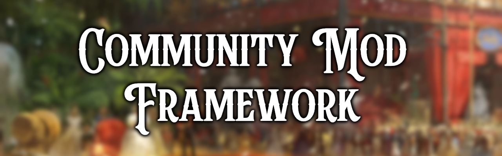

# Community Mod Framework


The Community Mod Framework is a utility mod that aims to improve mod inter-operability while giving mod-makers tools for GUI, Political Movements, Parties and mod detection. This framework makes several changes to GUI files, political movements, and parties.


## Content
* [Links](#links)
* [Getting Started](#getting-started)
* [Features](#features)
* [Philosophy](#philosophy)
* [Contributors](#contributors)


## Links
- Steam Page: https://steamcommunity.com/sharedfiles/filedetails/?id=3385002128
- GitHub Repository: https://github.com/Victoria-3-Modding-Co-op/Community-Mod-Framework
- Discord Channel: https://discord.com/channels/827163966551621662/1334219338202484746


## Getting Started
To set this mod as a dependency to your own mod, you will need to add this to your `metadata.json` file:
```
  "relationships" : [
    {
      "rel_type" : "dependency",
      "id" : "com.github.Victoria-3-Modding-Co-op.Community-Mod-Framework",
      "display_name" : "Community Mod Framework",
      "resource_type" : "mod",
      "version" : "1.*"
    }
  ]
```
*Also remember to add the mod to your required items on your own mods steam page.*


##  Philosophy
- This framework aims to preserve base game behavior and balance by default. If no other mods are in use, this framework should be *invisible* to the player.
- CMF is open to Pull Requests from the modding community. These are approved or rejected by consensus on the modding co-op. PRs will be rejected if they alter base game behavior. See [Our Contribution Rules](https://github.com/Victoria-3-Modding-Co-op/Community-Mod-Framework?tab=contributing-ov-file) for further details.


## Features
*Below is a high level list of features CMF offers. For a more fine-grained list and documentation on how they are used or extended please check out the [Community Mod Framework Wiki](https://github.com/Victoria-3-Modding-Co-op/Community-Mod-Framework/wiki).*

| Feature                                                                                                                                               | Description                                                                     |
|-------------------------------------------------------------------------------------------------------------------------------------------------------|---------------------------------------------------------------------------------|
| [Mod Detection Triggers](https://github.com/Victoria-3-Modding-Co-op/Community-Mod-Framework/wiki/Mod-Detection-Triggers)                             | Shared triggers for detecting mods                                              |
| [Debug Features](https://github.com/Victoria-3-Modding-Co-op/Community-Mod-Framework/wiki/Debug-Features)                                             | Debug mode toggle and flag viewer                                               |
| [Modding Effects](https://github.com/Victoria-3-Modding-Co-op/Community-Mod-Framework/wiki/Modding-Effects)                                           | Scripted effects for quality of life while modding                              |
| [Political Movement Weights](https://github.com/Victoria-3-Modding-Co-op/Community-Mod-Framework/wiki/Political-Movement-Weights)                     | Framework for deconflicting custom ideology movement weights                    |
| [Political Party Names](https://github.com/Victoria-3-Modding-Co-op/Community-Mod-Framework/wiki/Political-Party-Names)                               | Framework for deconflicting custom political party names                        |
| [UI Extensions](https://github.com/Victoria-3-Modding-Co-op/Community-Mod-Framework/wiki/UI-Extensions)                                               | Framework for integrating extensions to the basegame UI                         |
| [Custom Sidebar Buttons](https://github.com/Victoria-3-Modding-Co-op/Community-Mod-Framework/wiki/Custom-Sidebar-Buttons)                             | Framework for adding custom buttons to the sidebar                              |
| [Additional Event Windows](https://github.com/Victoria-3-Modding-Co-op/Community-Mod-Framework/wiki/Additional-Event-Windows)                         | Custom event windows for modders                                                |
| [Stylized Journal Progress Bars](https://github.com/Victoria-3-Modding-Co-op/Community-Mod-Framework/wiki/Stylized-Journal-Progress-Bars)             | Feature to add styling to progress bars to show drift and target values         |
| [Additional Journal Widgets](https://github.com/Victoria-3-Modding-Co-op/Community-Mod-Framework/wiki/Additional-Journal-Widgets)                     | Injectable journal entry widgets for modders                                    |
| [Additional Modifier Icons](https://github.com/Victoria-3-Modding-Co-op/Community-Mod-Framework/wiki/Additional-Modifier-Icons)                       | Custom timed modifier icons for modders                                         |
| [Particle Effects and Shaders](https://github.com/Victoria-3-Modding-Co-op/Community-Mod-Framework/wiki/Particle-Effects-and-Shaders)                 | Custom particle effects and shaders for modders                                 |
| [International Situations](https://github.com/Victoria-3-Modding-Co-op/Community-Mod-Framework/wiki/International-Situations)                         | UI & Journal framework providing support for CK3-style Situations/Struggles     |
| [International Organizations](https://github.com/Victoria-3-Modding-Co-op/Community-Mod-Framework/wiki/International-Organizations)                   | UI & Journal framework providing support for EU5-style IOs                      |
| [Character Animations and Environment](https://github.com/Victoria-3-Modding-Co-op/Community-Mod-Framework/wiki/Character-Animations-and-Environment) | Frameworks for custom character animations, camera angles, and evironments      |
| [Variable Error Supression](https://github.com/Victoria-3-Modding-Co-op/Community-Mod-Framework/wiki/Variable-Error-Supression)                       | Scripted effect for suppressing unset/unused variable and flag errors           |
| [Float Arrays](https://github.com/Victoria-3-Modding-Co-op/Community-Mod-Framework/wiki/Float-Arrays)                                                 | Indexed storage using scripted variables                                        |
| [Custom Mod Keybinds](https://github.com/Victoria-3-Modding-Co-op/Community-Mod-Framework/wiki/Custom-Mod-Keybinds)                                   | Framework for unifying custom keybinds for mods                                 |
| [Scripted Action Blockers](https://github.com/Victoria-3-Modding-Co-op/Community-Mod-Framework/wiki/on_action-Blockers)                               | Allows for blocking certain on_actions and other scripted content via variables |
| [Weekly Event Framework](https://github.com/Victoria-3-Modding-Co-op/Community-Mod-Framework/wiki/Weekly-Event-Framework)                             | Allows for firing scripted events via a weekly pulse                            |
| [Universal Names Compatibility](https://github.com/Victoria-3-Modding-Co-op/Community-Mod-Framework/wiki/Universal-Names-Compatibility)               | Sets up seamless compatibility with FUN's Universal Names mod                   |


## Victoria 3 Mod Tools
*Below is list of community-provided tools and assets to aid in modding:*

| Feature                                                                                    | Description                                     |
|--------------------------------------------------------------------------------------------|-------------------------------------------------|
| [Tiger Validator](https://github.com/amtep/tiger)                                          | Checks for errors and correctness in mod script |
| [Community Graphical Assets](https://github.com/Victoria-3-Modding-Co-op/Graphical-Assets) | Repository of gfx templates (PS, PDN, GIMP)     |
| [PDX Flag Builder](https://github.com/kaiser-chris/pdx-flag-builder)                       | Tool to build flags for Victoria 3 and EU5      |


## Contributors
- 1230james
- Alexedishi
- Bagel
- Bahmut
- Bananaman
- BrokenRobot
- CaelReader
- CaesarVincens
- Dingbat32
- KarafuruAmamiya
- Klein
- LordR
- Marmot
- MasterofGrey
- Mori
- rskhm
- Taylor
- Xier